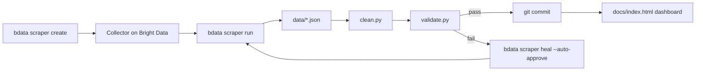

# Spidey-Sense

A self-healing GitHub issue radar for CNCF sandbox projects. It watches the
"good first issue" listings on two CNCF sandbox repos, keeps a structured,
always-fresh copy of that data in this repo, and repairs its own scraper
automatically if GitHub ever changes the page structure underneath it.

Built for the WeMakeDevs **"Into the Scrape-Verse"** hackathon (Bright Data track).

**Live dashboard:** https://shreya-d2604.github.io/spidey-sense/
**Demo video:** _(added after recording)_

## The problem

CNCF sandbox projects rely on "good first issue" labels to funnel new
contributors in, but that list only has value if someone's actually watching
it — and the watching breaks the moment the source page's structure changes,
usually silently. Spidey-Sense turns that into an unattended pipeline: scrape,
validate, and if the scrape looks broken, ask Bright Data's AI to repair the
scraper and try again — no human required to keep the radar accurate.

Targets:
- [WasmEdge](https://github.com/WasmEdge/WasmEdge) (Rust/Wasm)
- [bpfman-operator](https://github.com/bpfman/bpfman-operator) (eBPF)

Both are public repos, no login required, real open issues.

## How Bright Data Scraper Studio is used

This project's scrapers are **custom AI-generated collectors**, not entries
from Bright Data's pre-built scraper library — GitHub issue listings aren't
among their 800+ pre-built scrapers, so each one was built from scratch with
`bdata scraper create`:

```bash
bdata scraper create \
  "https://github.com/WasmEdge/WasmEdge/issues?q=is:open+is:issue+label:%22good+first+issue%22" \
  "Extract open GitHub issues: title, url, labels, issue number" \
  --name wasmedge-issues -o scrapers/wasmedge.create.json

bdata scraper create \
  "https://github.com/bpfman/bpfman-operator/issues?q=is:open+is:issue+label:%22good+first+issue%22" \
  "Extract open GitHub issues: title, url, labels, issue number" \
  --name bpfman-issues -o scrapers/bpfman.create.json
```

Each call kicks off Bright Data's AI pipeline (intent analysis → planning →
discovery → schema generation → code generation → preview), and returns a
Collector ID. These are the two collectors this project runs against —
proof of the create-and-run workflow the hackathon asks for:

| Target | Collector ID | Config |
|---|---|---|
| WasmEdge | `c_mt35fgejp9fp62uah` | [scrapers/wasmedge.create.json](scrapers/wasmedge.create.json) |
| bpfman-operator | `c_mt35mnl52ir8v9u3z7` | [scrapers/bpfman.create.json](scrapers/bpfman.create.json) |

A collector is triggered with `bdata scraper run <collector_id> <url>`, which
returns structured JSON straight from the live page.

### Self-healing

If [scripts/validate.py](scripts/validate.py) rejects a scrape (bad JSON,
empty result, or an issue missing its title/url/labels), the pipeline calls:

```bash
bdata scraper heal <collector_id> "<description of what looked broken>" --auto-approve
```

`heal` re-analyzes the live page with AI and patches the collector's
extraction logic in place. `--auto-approve` matters here: Bright Data's heal
flow is human-in-the-loop by default and stops at an approval gate — without
that flag, an unattended CI run would just hang waiting for a person to
approve the fix. After healing, the pipeline re-runs and re-validates before
committing anything.

The demo video shows this end-to-end with a **manually triggered break** —
we can't control when GitHub actually redesigns its issues page, so the
break shown on camera was introduced on purpose (via `bdata scraper heal`
itself, asked to corrupt the title extraction) to prove the recovery path
works, not because GitHub broke on cue.

## Architecture



The two targets run as independent jobs in GitHub Actions
([.github/workflows/spidey-sense.yml](.github/workflows/spidey-sense.yml)) —
one failing to heal doesn't block the other from running. Whatever the final
result is gets committed back into `data/*.json`, which both `docs/index.html`
(the dashboard) and this README's example output below are always reflecting.

## Setup & run

**Prerequisites:** Node.js ≥ 20, a [Bright Data](https://brightdata.com) API
key.

```bash
git clone https://github.com/shreya-d2604/spidey-sense.git
cd spidey-sense
npm install -g @brightdata/cli@0.3.5
```

**Run a scrape locally** (uses the `BRIGHTDATA_API_KEY` env var, or
`bdata login -k <key>`):

```bash
bdata scraper run c_mt35fgejp9fp62uah \
  "https://github.com/WasmEdge/WasmEdge/issues?q=is:open+is:issue+label:%22good+first+issue%22" \
  -o data/wasmedge.json
python3 scripts/clean.py data/wasmedge.json
python3 scripts/validate.py data/wasmedge.json
```

The collector IDs above are tied to this project's Bright Data account. To
reproduce the whole pipeline against your own account, run the `scraper
create` commands from the section above first, then substitute the
resulting Collector IDs.

**Run in CI:**
1. Add `BRIGHTDATA_API_KEY` as a repository secret (Settings → Secrets and
   variables → Actions)
2. Actions tab → **Spidey-Sense** → **Run workflow**

**View the dashboard:**
- Live: https://shreya-d2604.github.io/spidey-sense/
- Locally: serve the repo root (`python3 -m http.server`) and open
  `docs/index.html` — it reads data straight from GitHub, so a plain
  double-click won't load anything.

## Example structured output

From [data/wasmedge.json](data/wasmedge.json):

```json
[
  {
    "title": "[Community] Claim your WasmEdge Swag bag!",
    "url": "https://github.com/WasmEdge/WasmEdge/issues/551",
    "issue_number": "#551",
    "labels": ["good first issue"]
  },
  {
    "title": "Python SDK progress tracking",
    "url": "https://github.com/WasmEdge/WasmEdge/issues/2077",
    "issue_number": "#2077",
    "labels": ["binding-python", "enhancement", "good first issue"]
  }
]
```

## Repo structure

```
scrapers/    Collector configs from `bdata scraper create` (one per target)
data/        Scraped issue JSON — committed every CI run
scripts/     validate.py (checks scrape health), clean.py (dedupes/formats)
docs/        Static dashboard, deployed via GitHub Pages
.github/     The self-healing CI workflow
```

## Security

No API tokens or `.env` files are committed. `BRIGHTDATA_API_KEY` is read
from a GitHub Actions secret in CI and from the local `bdata` credential
store during development.

## AI-assistance disclosure

Claude Code was used for scaffolding, debugging, and drafting the scraper
CLI invocations, validation/cleaning scripts, CI workflow, and this
dashboard. All scraper logic, CI design, and self-healing behavior were
directed, reviewed, and verified end-to-end by the author, including live
runs against both target repos and a real (manually triggered) break-and-heal
cycle.
