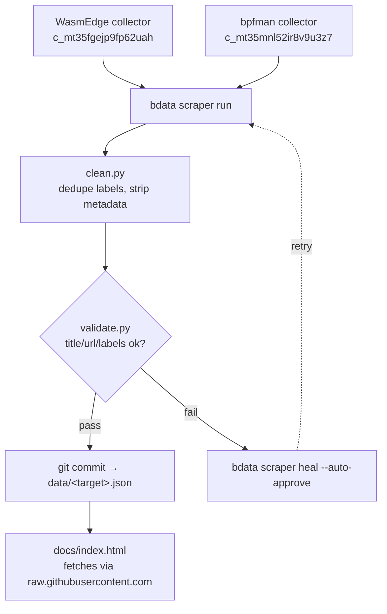

# Architecture

```mermaid
flowchart TD
    A1["WasmEdge collector<br/>c_mt35fgejp9fp62uah"] --> B
    A2["bpfman collector<br/>c_mt35mnl52ir8v9u3z7"] --> B
    B["bdata scraper run"] --> C["clean.py<br/>dedupe labels, strip metadata"]
    C --> D{"validate.py<br/>title/url/labels ok?"}
    D -->|pass| E["git commit → data/&lt;target&gt;.json"]
    D -->|fail| F["bdata scraper heal --auto-approve"]
    F -.retry.-> B
    E --> G["docs/index.html<br/>fetches via raw.githubusercontent.com"]
```
